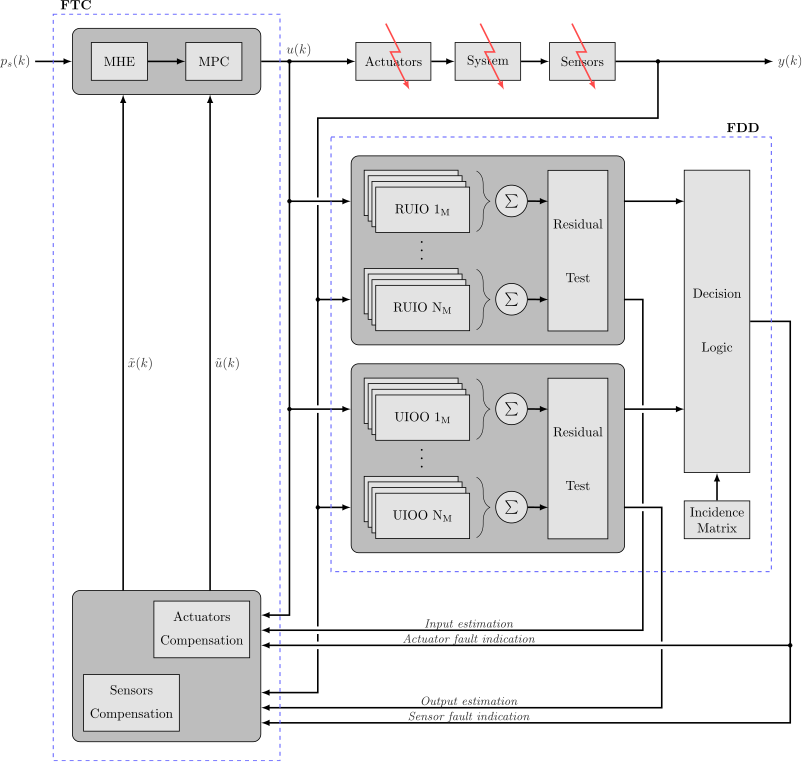

# Fault-tolerant Linear Parameter Varying Model Predictive Control Scheme for Industrial Processes (FT-LPVMPC)

## Abstract
This code presents a model-based strategy for fault tolerance in non-linear chemical processes. The structure of the proposed *Active Fault-Tolerant Control System* (AFTCS) is,

	

There, the *Fault Detection and Diagnosis* (FDD) stage uses banks of generalized observers to detect, isolate and estimate multiples faults. Specifically, a group of *LPV Reduced-order Unknown Input Observers* (LPV-RUIO) and *LPV Output Observers with Unknown Input* (LPV-UIOO) is used. Subsequently, this information is delivered to a reconfiguration mechanism that compensates the controller's input data, in order to achieve an acceptable post-fault system performance. The selected controller uses an *Moving Horizon Estimation* (MHE) technique to update the *Model-based Predictive Control* (MPC) internal model at each iteration time, enhancing the controller fault-tolerance capabilities.

Stability conditions of FDD module and *Fault-Tolerant Control* (FTC) unit are now guaranteed in terms of *Linear Matrix Inequalities* (LMI) problems.

Simulation results, based on a typical chemical industrial process, is given to illustrate the implementation and performance of such approach.

## Requirements
- At least an i5-3337U CPU@2.7 GHz (2 Cores) with 6 GB of RAM.
- [Matlab software](https://mathworks.com/) R2016b or greater

### Packages:
- [Yalmip](https://yalmip.github.io/)
- [Gurobi](https://www.gurobi.com/)
- [SeDuMi](http://sedumi.ie.lehigh.edu/)
- LMI Lab

## Paper info
Bernardi, Emanuel, and Eduardo J. Adam. "Fault-tolerant predictive control based on linear parameter varying scheme for industrial processes." *Journal of the Taiwan Institute of Chemical Engineers* 129 (2021): 1-14.

Send comments and questions to:

[Emanuel Bernardi](mailto:ebernardi@sanfrancisco.utn.edu.ar)
